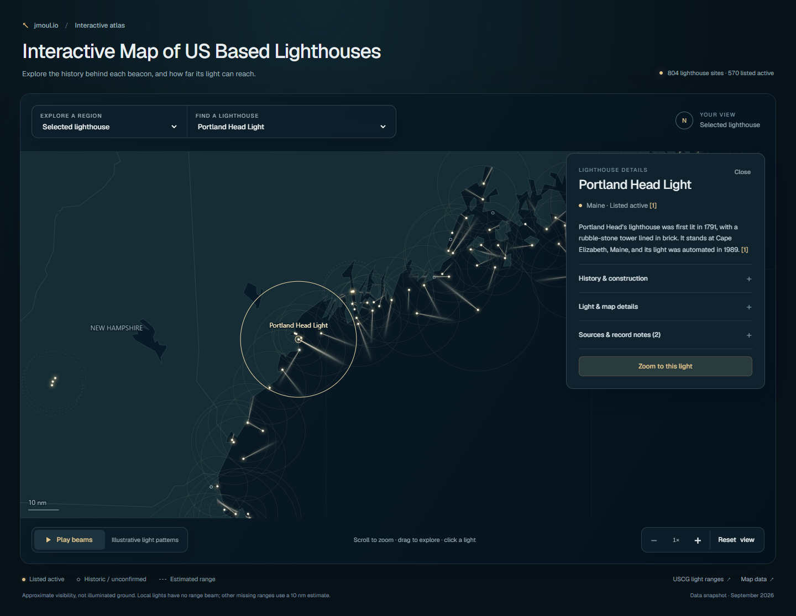

# Interactive Map of US Based Lighthouses

Explore 804 U.S. lighthouse sites on an animated night map, with light visibility ranges, short histories, and sources for individual records.

**[Open the live map on jmoul.io](https://jmoul.io/lighthouse-map/)**



The map includes the Atlantic, Pacific, Gulf and Great Lakes coasts, Alaska, Hawaii, and U.S. territories. Click a lighthouse for its summary, documented details, and citations. Scroll or pinch to zoom, drag to explore, and use the region selector or lighthouse search to move around.

Light beams use a cached texture with a white core, soft golden haze, and a smooth distance fade. The flat Canvas renderer limits resolution and frame rate, pauses when hidden or offscreen, and supports reduced motion. Alaska and Hawaii have independent overview panes.

## Run locally

Requires Node.js 20 or newer. There are no npm dependencies to install.

```sh
npm run build
npm start
```

Open **http://127.0.0.1:8080/lighthouse-map/**. To choose another port, run `npm start -- 8081`.

The built page is also committed at [`deploy/lighthouse-map/index.html`](deploy/lighthouse-map/index.html). The build requires only Node.js.

## Project files

| File | Purpose |
| --- | --- |
| `usa-map.js` | Canvas rendering, light appearance, navigation, and input handling |
| `map-geometry.js` | Shared map geometry preparation |
| `lighthouse-info.js` | Lighthouse details, summaries, and source panels |
| `website-map-template.html` | Map markup and dark interface styles |
| `build-usa-map.js` | Joins the released data and validates its review fingerprints |
| `build-website.js` | Builds the self-contained website document |
| `data/us-lighthouses.json` | Base lighthouse inventory |
| `data/info/base-corrections.json` | Reviewed corrections applied to the base inventory |
| `data/info/profiles.json` | Approved factual details and citations |
| `data/info/summaries.json` | Short summaries linked to the approved facts |
| `data/info/story-facts.json` | Additional sourced stories about keepers, rescues, engineering, and preservation |
| `data/info/story-release.json` | Independent source review bound to the exact additions and rewritten summaries |
| `data/info/light-appearance.json` | Sourced exceptions for particular light patterns |

## Data and interpretation

The map contains 804 sites. Its original 4,245 descriptive facts are preserved, with 162 separately reviewed story facts added to 100 rewritten lighthouse summaries. These include rescues, wartime damage, unusual construction, and the people who maintained or saved the towers. The inventory includes historic sites and documented replacements as well as surviving lighthouse towers; it is not an inventory of every buoy, minor aid, or ornamental light.

Visibility ranges, coordinates, and operating status are source snapshots. Unknown status is distinct from inactive status. Missing ranges use a labeled 10 nautical mile estimate where a beam is appropriate; documented local lights have no invented range beam. The animation illustrates approximate visibility and is not a navigation aid or a physical lighting simulation. Actual weather, terrain elevation, and navigational sectors are not modeled.

The normal build verifies the included released data against its recorded review hashes. Story additions are checked against their own source-review manifest before being appended to the original facts. Each rewritten summary retains sentence-level fact references and citations. Original research-input hashes are retained as provenance; downloaded source pages, raw research drafts, and the complete review archive are not part of this repository. Building the page does not independently re-research the facts. Per-record citations are available in the data and in the map.

See [third-party notices and data attribution](THIRD_PARTY_NOTICES.md) for D3, Geist, Natural Earth, and the lighthouse sources.

## Deploy or embed

Copy the contents of `deploy/lighthouse-map/` to a static web directory, including the license and attribution files. The HTML contains its map code, font, and data, so no separate asset service is needed.

On jmoul.io, a WordPress Custom HTML block can embed the map:

```html
<iframe
  src="https://jmoul.io/lighthouse-map/"
  title="Interactive Map of US Based Lighthouses"
  width="100%"
  height="850"
  loading="lazy"
  style="border:0; border-radius:12px;"
></iframe>
```

For another website, host your own copy and use its URL in the iframe.

The included `wordpress/jmoul-map-tracking.js` is the public client used by the live site. It runs only on jmoul.io's map URL and is inactive on localhost and other hosts. The private WordPress visitor dashboard, server integration, credentials, and visitor records are not included.
